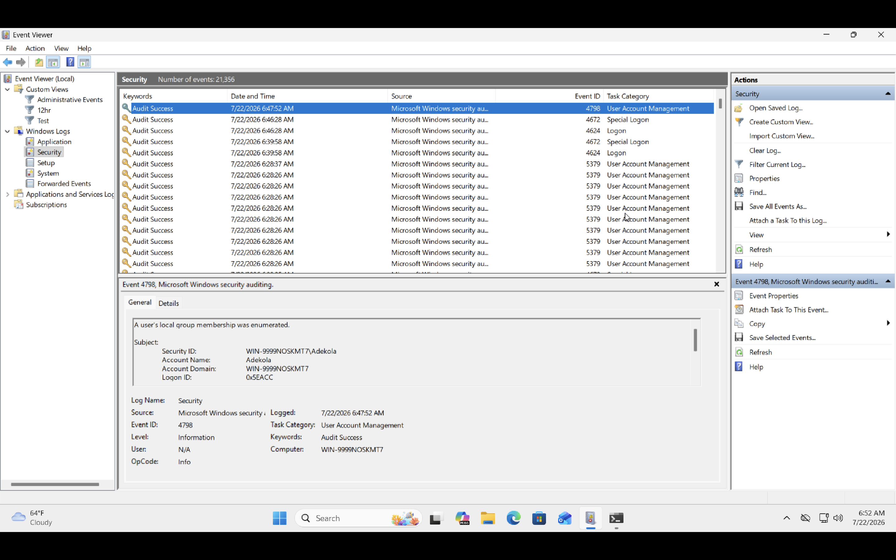
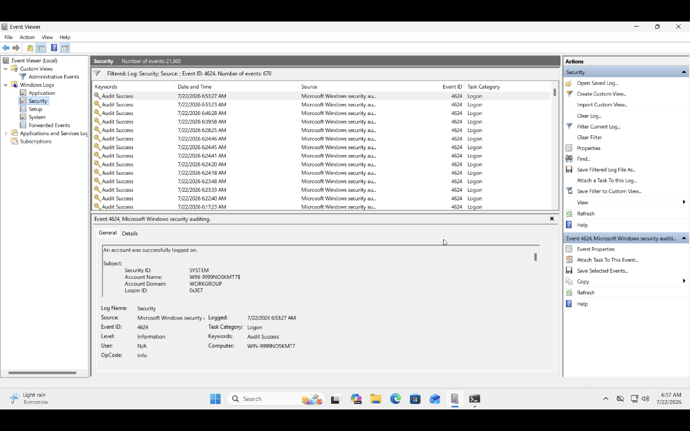
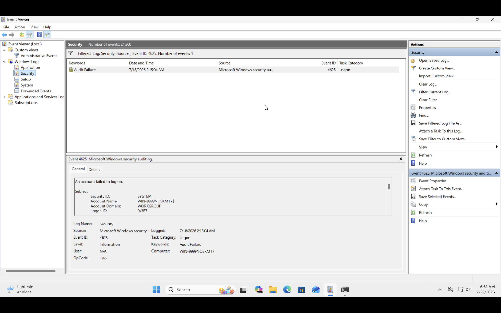
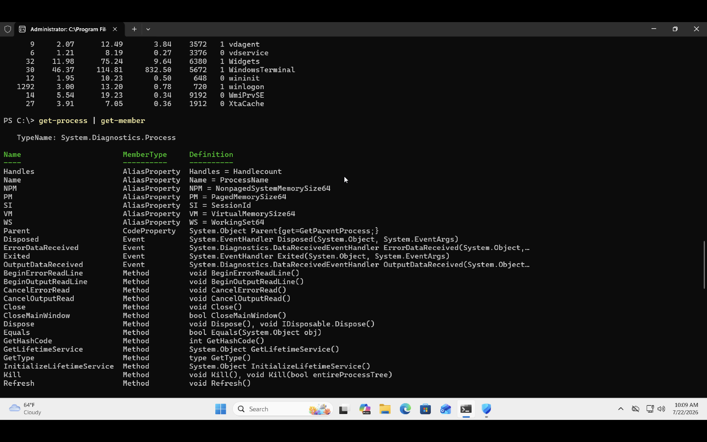
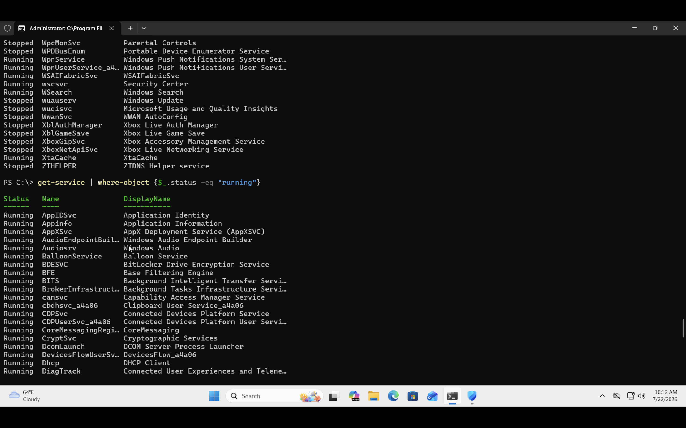
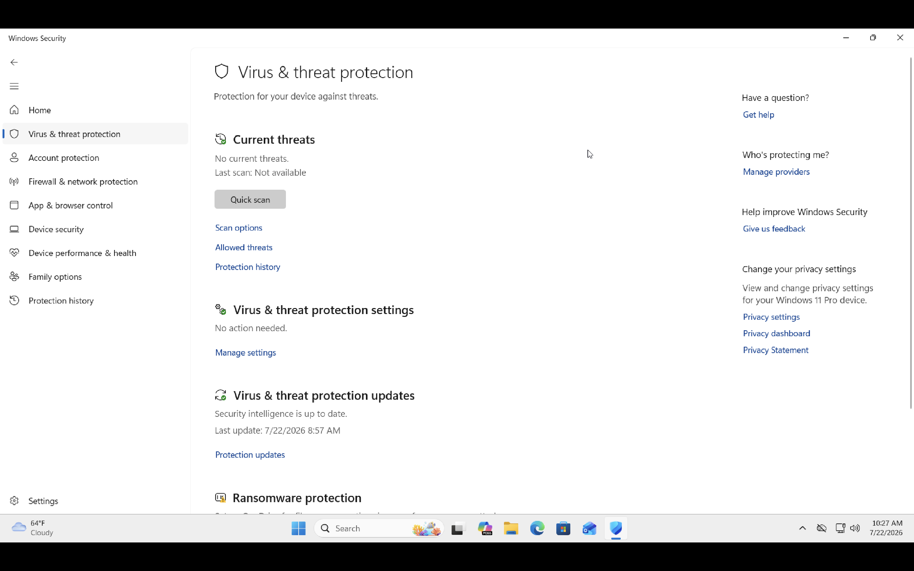
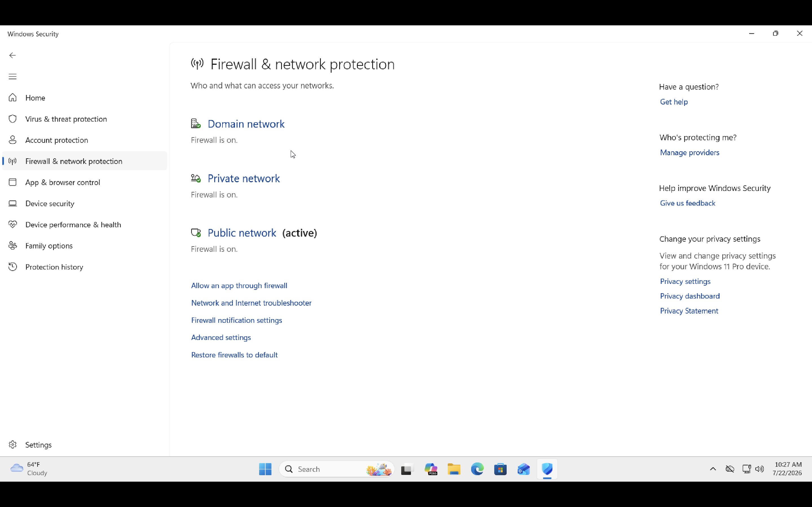

# Windows Security Investigation

## OBJECTIVE

The goal of this investigation was to become familiar with Windows event logs, PowerShell, and built-in administrative tools used by security analysts to monitor system activity. 

During this exercise, I explored authentication events, running processes, system services, and Windows Defender to understand how Windows records security-related events.

---

## Related Article

I documented the learning journey and lessons learned in more detail on Medium:
[Windows Investigation](https://medium.com/@koskiddoo/windows-investigation-report-fa51cd8f5b2f?sharedUserId=koskiddoo)

---

## Lab Environment

### Host Machine: Apple MacBook M1

#### Virtualization: UTM

### Operating System: Windows 11 ARM

### Investigation Toos: Event Viewer, PowerShell, Task Manager, Services, Windows Defender

---

## INVESTIGATION WORKFLOW

### 1. Examined Windows Security logs

I opened Event Viewer and navigated to:

Windows Logs → Security

The Security log contains records of authentication attempts, privilege usage, account management, and other security-related events.

During this investigation, I focused on authentication activity.

### 2. Reviewed successful logins

I filtered the Security log for Event ID 4624, which represents a successful logon.

This helped me understand:

- Which account logged in.
- The type of logon.
- The time of the event.
- The authentication package used.

I observed several successful interactive logons generated during my own use of the virtual machine.

### 3. Reviewed failed login attempts

Next, I searched for Event ID 4625, which records failed logon attempts.

During this lab, I did observe one authentication failure on my computer, however it's not a suspicous activity.

This demonstrated how Windows records unsuccessful authentication attempts and provides useful details for investigations.

### 4. Examined running processes

Using PowerShell, I listed all active processes.

_Get-Process_

This command displays running applications and system processes, making it useful for identifying unexpected or malicious activity. Also, I further investigated to be able to read the numbers easily and use the _Get-Member_ command to do this.

During the investigation, the running processes matched expected Windows services and applications.

### 5. Examined system services

I reviewed installed Windows services using:

_Get-Service_

This provided visibility into services currently running or stopped. I also proceed to getting only running services on my computer.

Understanding normal services is important because attackers may install malicious services to maintain persistence.

### 6. Reviewed Windows defender

Finally, I opened Windows Security to review the status of Microsoft Defender.

I confirmed that:

- Real-time protection was enabled.
- No active threats were detected.
- The system protection status was healthy.

---

## Commands used

_Get-Process:_	Display running processes

_Get-Service:_	List Windows services

_Get-EventLog -LogName Security:_  View Security Event Logs

_Get-EventLog -LogName Security -Newest 20:_  Display the latest Security events

---

## Investigation findings

During this investigation I found:

- Multiple successful authentication events (Event ID 4624) corresponding to interactive user logons.
- No unexpected user account creation events (Event ID 4720) during the observation period.
- Running processes appeared consistent with a standard Windows 11 installation.
- Windows services were operating as expected with no suspicious entries identified.
- Microsoft Defender reported that the system was protected and no threats were detected.

Based on the evidence collected, I found no indicators of suspicious activity during this investigation.

---

## Challenges

One challenge I encountered was understanding which log file contained the information I needed.

Initially, the number of available logs was overwhelming, but after exploring the _/var/log directory_ and using _journalctl_, it became much easier to locate authentication-related events.

I also learned that different Linux distributions may store logs differently, making it important to understand the system you're investigating.

---

## Lessons I learned

This investigation introduced me to several of the tools Windows security analysts use every day.

Before completing this lab, I knew that Windows generated security logs, but I had never explored them in detail. Reviewing authentication events helped me understand how user activity is recorded and how Event IDs can provide valuable context during an investigation.

Using PowerShell also reinforced how quickly system information can be gathered compared to navigating through graphical interfaces.

Most importantly, I learned that effective investigations begin by understanding what normal system activity looks like. Establishing this baseline will make it easier to recognize suspicious behavior in future labs involving malware analysis, threat detection, and security monitoring.

---

## Next Steps

To build on this foundation, I plan to:

- Investigate additional Windows Event IDs related to account management and privilege changes.
- Explore Sysmon to collect more detailed endpoint telemetry.
- Forward Windows Event Logs to a SIEM for centralized monitoring.
- Practice investigating simulated security incidents in a home SOC environment.
